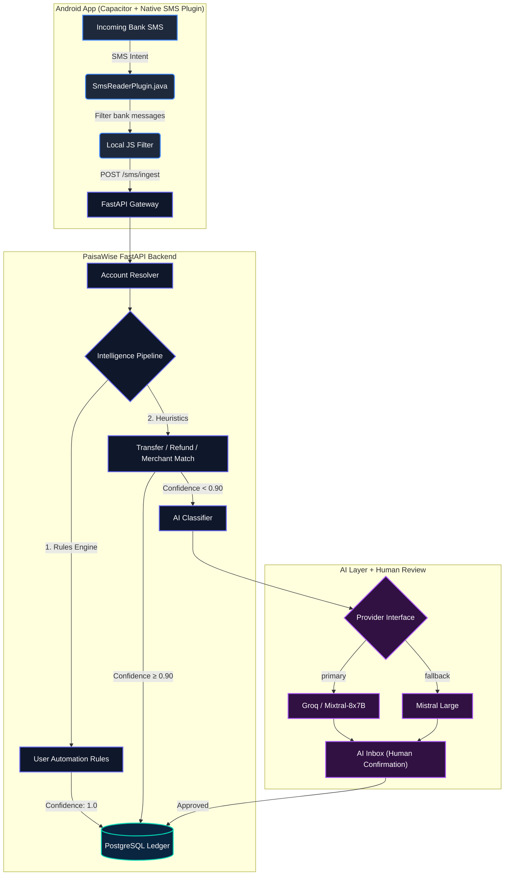

<div align="center">

# 💸 PaisaWise

### *Spend smart. Know more.*

**A privacy-first, AI-powered personal finance platform that automatically captures bank SMS alerts and turns them into actionable financial insights — available as a web app and native Android app.**

[](https://github.com/shlokbam/PaisaWise/actions/workflows/build-android.yml)


</div>

---

## 🧠 The Core Philosophy

Traditional expense trackers require you to manually log every purchase. PaisaWise operates **invisibly**:

1. 💳 **Transaction Occurs** — UPI, Card swipe, NetBanking
2. 📩 **Bank Sends SMS Alert** to your phone
3. 📱 **PaisaWise Captures SMS** — locally, without uploading OTPs or spam
4. 🔍 **Local Regex Parser** normalizes fields (amount, merchant, direction, account)
5. ⚙️ **Rules Engine + Heuristics** silently classify the transaction
6. 🤖 **AI Classification** triggers only for unknown or low-confidence entities
7. 👤 **Human-in-the-Loop Inbox** alerts you only when confirmation is needed
8. 📐 **Personalized Rules** are suggested automatically from your corrections

> **Key Product Rules:**
> - Transaction ≠ Expense — account movements aren't personal spending
> - Debit ≠ Personal Expense — family transfers, investments, IPOs are excluded
> - Credit ≠ Income — friend settlements and refunds are tracked and offset

---

## ✨ Features

### 📊 Dashboard
- Real-time summary cards: total income, total expenses, net savings, transaction count
- Month-over-month trend visualization
- Quick navigation to pending AI inbox reviews
- Recent transaction feed with category badges

### 📒 Transaction Ledger
- Full sortable and filterable transaction history
- Inline editing: category, merchant, notes, amount corrections
- Bulk management support
- Confidence badges showing AI classification certainty
- Per-transaction tags and merchant mapping

### 🤖 AI Inbox (Human-in-the-Loop)
- Auto-flagged low-confidence transactions requiring human review
- One-click approve or reassign category
- AI reasoning shown for each classification decision
- Batch review with keyboard-friendly actions

### 💰 Budget Manager
- Create monthly budgets by category (Food, Transport, Entertainment, etc.)
- Donut chart progress rings — visual burn rate at a glance
- Over-budget alerts shown inline
- Budget vs. actual comparison view

### 📅 Subscription Tracker
- Auto-detected recurring transactions (Netflix, Spotify, Zomato Pro, etc.)
- Monthly cost summary with billing cycle indicators
- Active / paused / cancelled status management

### ⚡ Automation Rules Engine
- User-definable rules: "If sender contains ZOMATO → Category: Food"
- Priority ordering with drag-to-reorder
- Regex and plain-text matcher support
- Confidence override to skip AI for known patterns
- Enabled/disabled toggle per rule

### 📈 Analytics
- Category spending breakdown (bar + pie charts)
- Monthly trend lines using Recharts SVG engine
- Income vs. expense comparison by month
- Top merchant leaderboard

### 💬 AI Chat Assistant
- Conversational financial assistant powered by Groq / Mistral
- Strict financial domain guardrails — no off-topic answers
- Context-aware tools: monthly summary, budget status, category breakdown
- Markdown-formatted responses with code block support
- **Available AI providers** (auto-selects whichever key is configured):
  - Groq (Mixtral-8x7B / Llama 3)
  - Mistral Large

### 📤 Export Engine
- Export transactions as **PDF** — branded, themed, with summary cards
- Export as **Excel (.xlsx)** — alternating rows, auto-column widths, category color coding
- Configurable date range: Last Week / Month / Year / Custom
- CSV fallback export

### ⚙️ Settings
- Change password
- Upload profile avatar
- Configure Groq and/or Mistral API keys
- Export financial statements
- **Android-only**: SMS Transaction Sync card (see Android section below)

---

## 📱 Android App

PaisaWise ships as a native Android APK built with **Capacitor** — the same React/Vite web frontend wrapped in a native Android shell.

### What the Android App Does Extra
- Requests `READ_SMS` + `RECEIVE_SMS` permission on first launch
- Scans entire SMS inbox on demand and filters for bank messages
- Automatically ingests matching bank SMS into PaisaWise
- Real-time sync — new bank SMS can be pushed to the backend

### Download the APK
Every push to `main` automatically builds a fresh APK via GitHub Actions:

1. Go to: [Actions → Build PaisaWise Android APK](https://github.com/shlokbam/PaisaWise/actions/workflows/build-android.yml)
2. Click the latest successful ✅ run
3. Scroll to **Artifacts** → download `PaisaWise-debug-N`
4. Unzip → transfer `app-debug.apk` to your phone

### Install the APK
1. On your Android phone: **Settings → Apps → Special app access → Install unknown apps**
2. Allow your Files/Downloads app to install APKs
3. Tap `app-debug.apk` → **Install** → **Open**

### First-time SMS Sync
1. Log in with your credentials
2. Go to **Settings → SMS Transaction Sync**
3. Tap **"Grant SMS Read Permission"** → Allow
4. Tap **"Sync All Bank Messages"** → all bank SMS are filtered and imported

> ⚠️ The app connects to your backend over local WiFi. Your phone and Mac must be on the same network. The backend URL is baked in at build time (default: `http://192.168.1.4:8000/api/v1`). To change it, trigger the workflow manually from the Actions tab with a custom URL.

---

## 🛠 Technology Stack

### Backend
| Package | Version | Purpose |
|---|---|---|
| Python | 3.11+ | Runtime |
| FastAPI | ≥ 0.115 | Async API framework |
| SQLAlchemy | ≥ 2.0 | ORM |
| PostgreSQL | 15+ | Relational database |
| Alembic | ≥ 1.13 | Database migrations |
| python-jose | ≥ 3.3 | JWT authentication |
| passlib + bcrypt | ≥ 1.7 | Password hashing |
| httpx | ≥ 0.27 | Async HTTP client (AI APIs) |
| fpdf2 | ≥ 2.7.9 | PDF export generation |
| openpyxl | ≥ 3.1.5 | Excel export generation |
| pytest | ≥ 8.1 | Testing suite |

### Web Frontend
| Package | Version | Purpose |
|---|---|---|
| React | 19 | UI framework |
| TypeScript | 6 | Type safety |
| Vite | 8 | Build tool |
| Tailwind CSS | v4 | Styling |
| Recharts | 3 | Data visualization |
| Lucide React | Latest | Iconography |

### Android
| Package | Version | Purpose |
|---|---|---|
| @capacitor/core | 8.5 | Native bridge |
| @capacitor/android | 8.5 | Android platform |
| @capacitor/cli | 8.5 | Build tooling |
| Custom SmsReaderPlugin | — | Native Java SMS reading |

### AI Providers
| Provider | Models | Role |
|---|---|---|
| Groq | Mixtral-8x7B, Llama 3 | Primary (fast inference) |
| Mistral | Mistral Large | Fallback |

---

## 📊 System Architecture



---

## 📁 Project Structure

```
PaisaWise/
├── .github/
│   └── workflows/
│       └── build-android.yml       # CI: auto-builds Android APK on every push
│
├── backend/
│   ├── app/
│   │   ├── api/                    # API route handlers
│   │   │   ├── auth.py             # Register, login, JWT refresh
│   │   │   ├── transactions.py     # CRUD ledger + PDF/Excel/CSV export
│   │   │   ├── dashboard.py        # Summary metrics and monthly trends
│   │   │   ├── budgets.py          # Budget CRUD and burn rate
│   │   │   ├── subscriptions.py    # Recurring transaction management
│   │   │   ├── rules.py            # Automation rule CRUD
│   │   │   ├── analytics.py        # Category breakdown and trend charts
│   │   │   ├── ai.py               # AI chat endpoint with guardrails
│   │   │   ├── categories.py       # Category listing
│   │   │   ├── mobile.py           # SMS ingest + batch sync endpoint
│   │   │   └── deps.py             # Auth dependency injection
│   │   ├── ai/
│   │   │   ├── tools.py            # AI read-only tool definitions
│   │   │   ├── prompts.py          # System prompt + domain guardrails
│   │   │   └── classifier.py       # Groq/Mistral provider abstraction
│   │   ├── models/                 # SQLAlchemy ORM models
│   │   ├── schemas/                # Pydantic validation schemas
│   │   ├── parsers/
│   │   │   └── sms_parser.py       # Regex SMS parser (HDFC, SBI, ICICI, Axis…)
│   │   ├── services/               # Transaction processing pipeline
│   │   └── main.py                 # FastAPI app entrypoint + CORS config
│   ├── tests/                      # Pytest test suites
│   ├── init_db.py                  # DB initializer + seed data
│   └── requirements.txt
│
├── web/
│   ├── src/
│   │   ├── pages/
│   │   │   ├── Dashboard.tsx       # Summary + recent transactions
│   │   │   ├── Transactions.tsx    # Full ledger with filters
│   │   │   ├── AIInbox.tsx         # Human-in-the-loop review queue
│   │   │   ├── Budgets.tsx         # Budget rings and management
│   │   │   ├── Subscriptions.tsx   # Recurring tracker
│   │   │   ├── Rules.tsx           # Automation rules editor
│   │   │   ├── Analytics.tsx       # Charts and breakdowns
│   │   │   ├── AIChat.tsx          # Conversational AI assistant
│   │   │   ├── Settings.tsx        # Keys, exports, SMS sync (Android)
│   │   │   └── Login.tsx           # Auth screen
│   │   ├── services/
│   │   │   ├── api.ts              # Authenticated fetch client
│   │   │   └── sms.ts              # Capacitor SMS native bridge
│   │   ├── context/
│   │   │   ├── AuthContext.tsx     # JWT + user session management
│   │   │   └── ToastContext.tsx    # Global notification toasts
│   │   └── App.tsx                 # Navigation layout
│   ├── android/                    # Capacitor-generated Android project
│   │   └── app/src/main/java/com/paisawise/app/
│   │       ├── MainActivity.java   # Registers native plugins
│   │       └── SmsReaderPlugin.java # Native Java SMS reader
│   ├── capacitor.config.ts         # Capacitor app config
│   ├── .env                        # Web API URL (127.0.0.1)
│   ├── .env.android                # Android API URL (LAN IP)
│   └── package.json
│
└── android_mock/
    └── android_mock.py             # SMS simulation script for local testing
```

---

## ⚙️ Local Setup Guide

### Prerequisites
- Python 3.11+
- Node.js 22+
- PostgreSQL 15+

---

### Step 1 — Database

```bash
# Create the database
createdb paisawise
```

---

### Step 2 — Backend

```bash
cd backend

# Create virtual environment
python3.11 -m venv venv
source venv/bin/activate          # macOS/Linux
# venv\Scripts\activate           # Windows

# Install dependencies
pip install -r requirements.txt

# Configure environment
cp .env.example .env              # then edit .env
```

Edit `backend/.env`:
```env
DATABASE_URL=postgresql://localhost/paisawise
SECRET_KEY=your-long-random-secret-key-here

# AI Providers — configure at least ONE
GROQ_API_KEY=gsk_xxxxxxxxxxxxxxxxxxxx
MISTRAL_API_KEY=xxxxxxxxxxxxxxxxxxxx
```

> 💡 **AI Keys**: Get Groq free at [console.groq.com](https://console.groq.com). Get Mistral at [console.mistral.ai](https://console.mistral.ai). You only need one — PaisaWise auto-selects whichever is configured.

```bash
# Initialize database tables + seed data
python init_db.py

# Start backend
uvicorn app.main:app --host 127.0.0.1 --port 8000 --reload
```

API docs available at: **http://127.0.0.1:8000/api/v1/docs**

---

### Step 3 — Web Frontend

```bash
cd web

# Install dependencies
npm install

# Start dev server
npm run dev -- --host 127.0.0.1 --port 3000
```

Open: **http://127.0.0.1:3000**

Default credentials:
| Field | Value |
|---|---|
| Email | `shlok@paisawise.com` |
| Password | `password` |

---

### Step 4 — AI Keys (In-App)

After logging in, go to **Settings → AI API Keys** and enter your Groq or Mistral key. You can also set these as environment variables in `backend/.env`.

---

### Step 5 — SMS Simulation (Local Testing)

To simulate bank SMS without a real phone:

```bash
# From repo root
backend/venv/bin/python android_mock/android_mock.py
```

This script:
1. Filters spam, OTPs, and promotional messages
2. Parses HDFC, SBI, ICICI, Axis SMS formats
3. Queues transactions locally in `android_mock_queue.json`
4. Authenticates via JWT and batch-syncs to `/api/v1/mobile/sync`
5. Prints classification results with rule matches and confidence scores

---

## 📲 Android App Build (GitHub Actions — No Local SDK Needed)

The Android APK is built automatically via CI. No Android Studio required.

### Automatic Builds
Every push to `main` triggers a build. Download from:
**Actions → Build PaisaWise Android APK → Artifacts**

### Manual Build with Custom Backend URL
1. Go to **Actions → Build PaisaWise Android APK**
2. Click **"Run workflow"**
3. Enter your backend URL: `http://YOUR_MAC_IP:8000/api/v1`
4. Click **Run workflow** → download APK when complete

### Find Your Mac's IP
```bash
ipconfig getifaddr en0
# e.g. 192.168.1.4
```

### For Local Network Use (Phone + Mac on Same WiFi)
Restart your backend to listen on all interfaces:
```bash
uvicorn app.main:app --host 0.0.0.0 --port 8000 --reload
```

---

## 🧪 Running Tests

```bash
# From repo root
backend/venv/bin/pytest backend/tests/ -v
```

Tests cover: SMS regex parsing, rules evaluation, JWT auth, transaction API endpoints.

---

## 🔒 Security & Privacy

| Concern | How PaisaWise Handles It |
|---|---|
| **OTP Protection** | Regex pre-filter runs on-device; OTP-containing messages are never transmitted |
| **Password Storage** | bcrypt salted hash — raw passwords never stored |
| **Data Isolation** | All queries enforce `user_id == current_user.id` — no cross-user data leakage |
| **AI Read-Only** | The AI assistant can only read data via defined tools — it cannot write, delete, or modify records |
| **Domain Guardrails** | AI system prompt enforces financial-only responses; off-topic queries are politely refused |
| **JWT Security** | Tokens are short-lived with secure secret key signing |

---

## 🗺 Roadmap

- [ ] **Goals & Savings Tracker** — set targets with progress rings
- [ ] **Spending Trends Charts** — 3/6/12 month category trend lines
- [ ] **Bank Statement CSV Import** — HDFC, SBI, ICICI statement parsing
- [ ] **Budget Forecasting** — predict month-end spend from daily burn rate
- [ ] **PWA Support** — installable on iOS via Add to Home Screen
- [ ] **Anomaly Detection** — flag unusual spending spikes automatically
- [ ] **Tax Summary Export** — 80C, HRA, medical deductibles report
- [ ] **Google Sheets Sync** — real-time ledger mirroring

---

## 📄 License

MIT — feel free to fork, extend, and self-host.

---

<div align="center">
Built with ❤️ by <a href="https://github.com/shlokbam">shlokbam</a>
</div>
