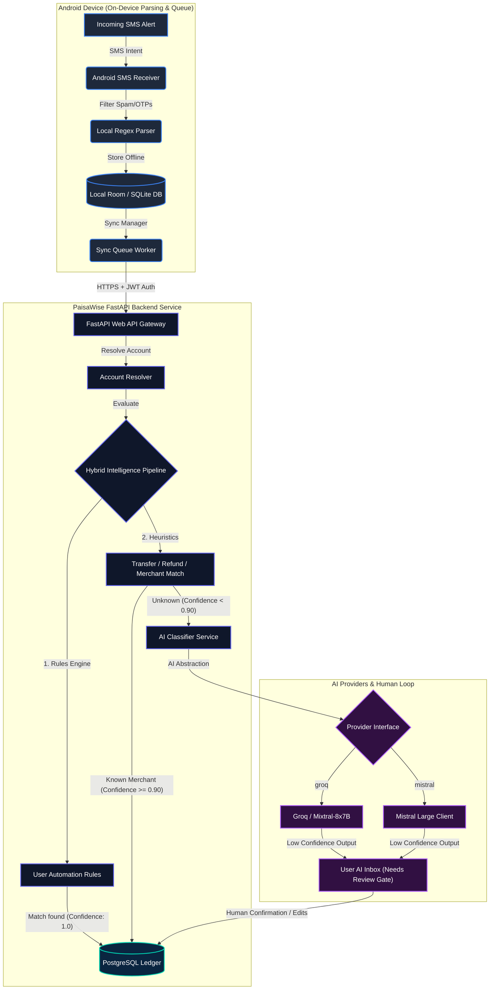

# PaisaWise

> **Spend smart. Know more.**

PaisaWise is a privacy-first, automated personal finance management application that turns transaction SMS alerts into deterministic financial insights. It eliminates manual logging by automatically capturing, parsing, and classifying transactions locally on the user's device, syncing with a centralized Python backend, and providing a clean, premium console for dashboards, budgets, rules, and conversational AI assistance.

---

## 🚀 The Core Philosophy

Traditional expense trackers require the user to manually enter every single purchase. PaisaWise operates invisibly:

1. **Transaction Occurs** (UPI, Card swipe, NetBanking).
2. **Bank Sends SMS Alert**.
3. **PaisaWise Captures SMS** locally (no full inbox upload, no OTP/spam transmission).
4. **Local Regex Parser** normalizes fields (amount, merchant, direction, account last 4).
5. **Central Rules Engine & Heuristics** process classifications silently.
6. **AI Classification** triggers only for unknown/low-confidence entities.
7. **Human-in-the-Loop** Inbox alerts the user only when confirmation is needed.
8. **Personalized Rules** are suggested automatically based on user corrections.

### ⚠️ Product Rules:
* **Transaction != Expense**: Money moving through accounts does not equal personal spending.
* **Debit != Personal Expense**: Family transfers, stocks, and investments are excluded.
* **Credit != Personal Income**: Friend settlements and refunds are tracked and offset.

---

## 🛠 Technology Stack

### Backend
* **Python 3.11** (provides maximum stability and pre-compiled binary packages)
* **FastAPI** (asynchronous API framework with automated OpenAPI docs)
* **SQLAlchemy** (ORM models)
* **PostgreSQL** (relational transaction ledger database)
* **Pytest** (unit and integration testing suite)

### Web Frontend
* **ReactJS** & **TypeScript**
* **Tailwind CSS v4** (utilizing native `@theme` directives and variables)
* **Recharts** (premium, sleek SVG data visualization)
* **Lucide React** (clean premium iconography)

### AI Core
* **Groq API** (configured defaults running Mixtral-8x7B)
* **Mistral API** (alternative fallback client)
* **AI Provider Abstraction** (interface-isolated drivers for model flexibility)

---

## 📊 System Architecture



---

## 📁 Workspace Directory Structure

```
PaisaWise/
├── backend/
│   ├── app/
│   │   ├── api/            # API Route definitions (auth, dashboard, transactions, rules)
│   │   ├── core/           # Security, db session, and Pydantic configurations
│   │   ├── models/         # SQLAlchemy database models
│   │   ├── schemas/        # Pydantic validation schemas
│   │   ├── services/       # Core transaction processing pipeline
│   │   ├── ai/             # AI provider drivers and classifier logic
│   │   ├── parsers/        # SMS local regex parsing scripts
│   │   └── main.py         # FastAPI application entrypoint
│   ├── tests/              # Pytest unit and integration test suites
│   └── requirements.txt    # Python backend package list
├── web/
│   ├── src/
│   │   ├── components/     # UI elements, widgets, and charts
│   │   ├── pages/          # Dashboard, Ledger, Inbox, Rules, Analytics, AI Chat
│   │   ├── services/       # Fetch API client client
│   │   ├── context/        # Authentication Context
│   │   ├── App.tsx         # Central layout assembly
│   │   └── index.css       # Custom styles and Tailwind base layers
│   ├── postcss.config.js
│   ├── tailwind.config.js
│   └── package.json
├── android_mock/
│   └── android_mock.py     # Local SMS simulation and syncing script
└── README.md
```

---

## ⚙️ Setup & Local Installation

### 1. Central Database Setup
Ensure PostgreSQL is installed and active on port `5432`:
```bash
# Create the PaisaWise database
createdb paisawise
```

### 2. Backend Server Setup
Configure the environment variables in a `.env` file inside `backend/`:
```env
DATABASE_URL=postgresql://localhost/paisawise
SECRET_KEY=yoursecretkeyhere
AI_PROVIDER=groq
AI_MODEL=mixtral-8x7b-32768
GROQ_API_KEY=your_groq_api_key_here
MISTRAL_API_KEY=your_mistral_api_key_here
```

Initialize the virtual environment and install packages:
```bash
cd backend
python3.11 -m venv venv
source venv/bin/activate
pip install -r requirements.txt
```

Initialize database tables and default seed data (users, categories, rules, and mock ledger items):
```bash
python init_db.py
```

Start the FastAPI application:
```bash
uvicorn app.main:app --host 127.0.0.1 --port 8000 --reload
```
* Interactive OpenAPI Documentation will be hosted at: `http://127.0.0.1:8000/api/v1/docs`

### 3. Web Console Setup
Navigate to the `web` directory and install front-end dependencies:
```bash
cd ../web
npm install
```

Start the Vite development web server:
```bash
npm run dev -- --host 127.0.0.1 --port 3000
```
* Open your browser at: `http://127.0.0.1:3000`
* Default login credentials:
  * **Email**: `shlok@paisawise.com`
  * **Password**: `password`

---

## 📲 Offline Capture & Sync Simulator

We provide a Python CLI script simulating Android's BroadcastReceiver, local regex filtering, and offline sync queuing:

```bash
# From workspace root
backend/venv/bin/python android_mock/android_mock.py
```

### Flow Tested:
1. Filters out spam alerts (e.g. coupon codes) and transaction OTPs.
2. Extracts transaction details from HDFC, SBI, ICICI format mock SMS logs.
3. Appends transaction data to a local offline JSON queue file (`android_mock_queue.json`).
4. Authenticates via JWT and batch uploads the offline records using `/mobile/sync`.
5. Logs backend processing results showing applied custom rules and heuristics.

---

## 🧪 Testing the Codebase

Unit and integration tests cover database models, SMS regex matchers, rules evaluation, and protected APIs:

```bash
# From workspace root
backend/venv/bin/pytest backend/tests/
```

---

## 🔒 Security & Privacy Directives

1. **Local Processing Priority**: Parsing, duplicate scanning, and OTP filtering must happen on-device. No OTP or message containing credentials/unrelated text is sent to the backend.
2. **Password Isolation**: Raw passwords are salted and hashed using `bcrypt` before database inserts.
3. **Read-Only AI Assistant**: The floating chat helper operates using strict database read tools (e.g., `get_monthly_summary`, `get_budget_status`). The AI model cannot alter database records, transfer funds, or call writing functions.
4. **Data Isolation**: Query filters enforce user-level verification (`Transaction.user_id == current_user.id`) across all ledger endpoints.
