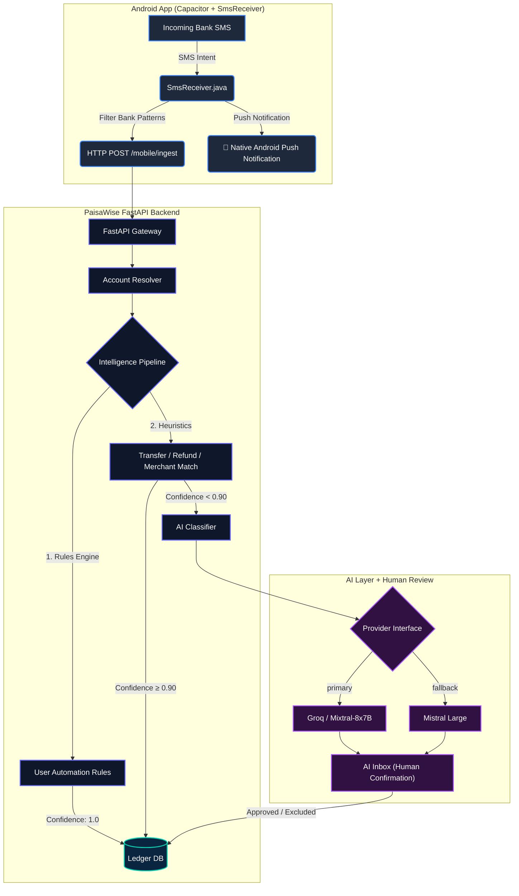

<div align="center">

# 💸 PaisaWise

### *Spend smart. Know more.*

**A privacy-first, AI-powered personal finance platform that automatically captures bank SMS alerts and turns them into actionable financial insights — available as a web app and native Android app.**


</div>

---

## 📱 Download Latest Android APK

Get the pre-compiled native Android app directly from this repository:

📥 **[Download Latest PaisaWise Android APK (app-debug.apk)](https://github.com/shlokbam/PaisaWise/raw/main/apk/app-debug.apk)**

> ⚡ **Features in latest APK:** Real-Time Background SMS Listener, Instant Push Notifications (`🔔 PaisaWise Auto-Sync`), Incremental Timestamp Memory, 1-Click Exclude/Delete in AI Inbox, and Mobile Responsive UI!

---

## 🧠 The Core Philosophy

Traditional expense trackers require you to manually log every purchase. PaisaWise operates **invisibly**:

1. 💳 **Transaction Occurs** — UPI, Card swipe, NetBanking
2. 📩 **Bank Sends SMS Alert** to your phone
3. 📱 **Real-Time Background Listener (`SmsReceiver.java`)** intercepts bank SMS instantly
4. 🔍 **Local Regex Parser** normalizes fields (amount, merchant, direction, account)
5. ⚙️ **Rules Engine + Heuristics** silently classify the transaction
6. 🤖 **AI Classification** triggers only for unknown or low-confidence entities
7. 👤 **Human-in-the-Loop AI Inbox** alerts you only when review is needed
8. 📐 **Personalized Rules** are suggested automatically from your corrections

> **Key Product Rules:**
> - Transaction ≠ Expense — account movements aren't personal spending
> - Debit ≠ Personal Expense — family transfers, business expenses, investments are excluded
> - Credit ≠ Income — friend settlements and refunds are tracked and offset

---

## ✨ Features

### ⚡ Real-Time SMS Auto-Sync (Android Native)
- **Background Receiver (`SMS_RECEIVED`)**: Intercepts bank SMS in real time as soon as you make a payment (BOB, HDFC, SBI, ICICI, Axis, Kotak, Paytm, PhonePe, GPAY, etc.).
- **Instant Local Push Notifications**: Displays a native phone notification when a transaction is logged:
  > 🔔 *PaisaWise Auto-Sync: New bank transaction automatically logged & categorized!*
- **Incremental Timestamp Sync**: Remembers `last_synced_timestamp` in `SharedPreferences` — historical duplicate messages (600+ items) are **never re-scanned or stacked**.

### 🤖 AI Inbox (Human-in-the-Loop)
- Flagged low-confidence transactions requiring review.
- **1-Click Quick Actions**:
  - **`✓ Personal`**: Confirms as a personal expense.
  - **`🚫 Exclude`**: Marks as non-personal/irrelevant (excludes from personal budget & expenses).
  - **`🗑️ Delete`**: Permanently deletes the record.
  - **`✎ Edit`**: Fine-tune ownership, category, or type.
- **Auto-Rule Suggestions**: Repeated corrections prompt rule creation automatically.

### 💬 AI Chat Assistant
- Conversational financial assistant powered by **Groq / Mistral**.
- Context-aware tools: query spendings, budget limits, category breakdowns, monthly summaries.
- **Rich Markdown Rendering**: Renders HTML data tables (`|`), blockquotes (`>`), bullet lists, and formatted code blocks seamlessly on web & mobile.
- Domain guardrails — strictly refuses non-financial off-topic queries.

### 📒 Financial Ledger
- Full transaction history with search and preset filters.
- **Dual Responsive Layout**:
  - **Mobile Card View**: Optimized card layout with inline quick-editing on mobile viewports.
  - **Desktop Data Table**: Full 8-column data grid for desktop screens.

### 📊 Dashboard & Analytics
- Real-time summary metrics: total income, total expenses, net savings, personal spend.
- Category spend breakdowns and trend visualization using Recharts.
- Recent transaction feed with category badges.

### 💰 Budget & Subscription Manager
- Monthly category budgets with interactive burn-rate progress rings.
- Auto-detected recurring subscriptions (Netflix, Spotify, Zomato Pro) with billing status tracking.

### 📤 Financial Statement Exporter
- Export statements to **PDF** (custom branded summary metrics + table) or **Excel (.xlsx)** (styled header, auto-fit columns, zebra rows).
- Configurable date ranges (Week, Month, Year, Custom).

---

## 🛠 Technology Stack

### Backend
| Package | Version | Purpose |
|---|---|---|
| Python | 3.11+ | Runtime |
| FastAPI | ≥ 0.115 | Async API framework |
| SQLAlchemy | ≥ 2.0 | ORM |
| SQLite / PostgreSQL | 15+ | Relational database |
| python-jose | ≥ 3.3 | JWT authentication |
| passlib + bcrypt | ≥ 1.7 | Password hashing |
| httpx | ≥ 0.27 | Async HTTP client (AI APIs) |
| fpdf2 | ≥ 2.7.9 | PDF export generation |
| openpyxl | ≥ 3.1.5 | Excel export generation |

### Web Frontend
| Package | Version | Purpose |
|---|---|---|
| React | 19 | UI framework |
| TypeScript | 6 | Type safety |
| Vite | 8 | Build tool |
| Tailwind CSS | v4 | Styling |
| Recharts | 3 | Data visualization |
| Lucide React | Latest | Iconography |

### Android
| Package | Version | Purpose |
|---|---|---|
| @capacitor/core | 8.5 | Native bridge |
| @capacitor/android | 8.5 | Android platform |
| Custom SmsReceiver | Native Java | Real-time SMS BroadcastReceiver |
| Custom SmsReaderPlugin | Native Java | Incremental SMS reader & SharedPreferences |

---

## 📊 System Architecture



---

## 📁 Project Structure

```
PaisaWise/
├── backend/
│   ├── app/
│   │   ├── api/                    # API route handlers (auth, ledger, mobile, ai, export...)
│   │   ├── ai/                     # AI classifier & prompt tools
│   │   ├── models/                 # SQLAlchemy ORM models
│   │   ├── schemas/                # Pydantic schemas
│   │   ├── parsers/
│   │   │   └── sms_parser.py       # Regex SMS parser (BOB, HDFC, SBI, ICICI, Axis...)
│   │   └── main.py                 # FastAPI application entrypoint
│   └── requirements.txt
│
├── web/
│   ├── src/
│   │   ├── pages/                  # Dashboard, Transactions, AIInbox, AIChat, Settings...
│   │   ├── services/
│   │   │   ├── api.ts              # Fetch client
│   │   │   └── sms.ts              # Native SMS bridge with timestamp memory
│   │   └── App.tsx                 # App router layout
│   └── android/                    # Capacitor Android Native project
│       └── app/src/main/java/com/paisawise/app/
│           ├── MainActivity.java   # App entry point
│           ├── SmsReceiver.java    # Real-time background SMS listener
│           └── SmsReaderPlugin.java # Native SMS reader plugin
└── README.md
```

---

## ⚙️ Local Setup Guide

### 1. Backend Setup

```bash
cd backend

# Activate virtual environment
source venv/bin/activate

# Install dependencies
pip install -r requirements.txt

# Start backend server bound to local Wi-Fi IP
uvicorn app.main:app --host 0.0.0.0 --port 8000 --reload
```

---

### 2. Web Frontend Setup

```bash
cd web

# Install dependencies
npm install

# Start Vite dev server
npm run dev
```

Open: **http://localhost:5173**

---

### 3. Installing the Android APK

1. Transfer [`app-debug.apk`](web/android/app/build/outputs/apk/debug/app-debug.apk) to your Android phone.
2. Allow installation of unknown apps if prompted.
3. Open PaisaWise → Log in → Go to **Settings**.
4. Tap **"Grant SMS & Notification Permission"**.
5. Real-time background transaction tracking is now **active**!

---

## 🔒 Security & Privacy

| Concern | How PaisaWise Handles It |
|---|---|
| **OTP Protection** | Regex pre-filter runs locally; OTPs and personal chat messages are ignored |
| **Data Isolation** | All queries enforce strict `user_id == current_user.id` scoping |
| **Incremental Sync** | Only un-synced messages are processed using timestamp memory |
| **Domain Guardrails** | AI assistant strictly refuses non-financial off-topic queries |

---

## 📄 License

MIT — feel free to fork, extend, and self-host.

---

<div align="center">
Built with ❤️ by <a href="https://github.com/shlokbam">shlokbam</a>
</div>
